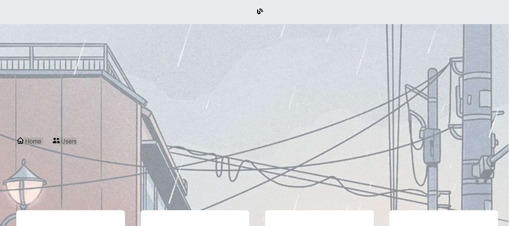
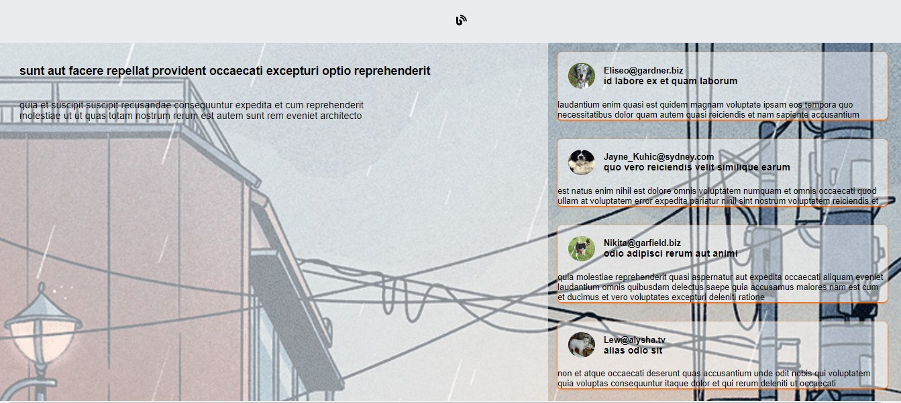
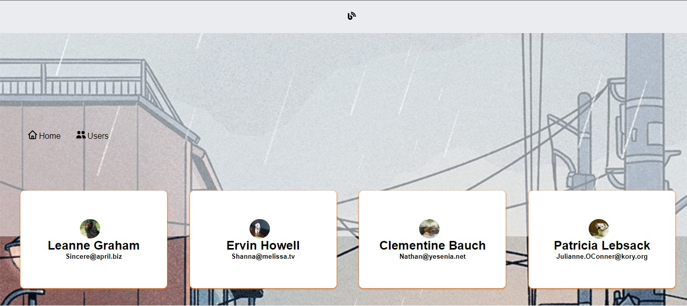
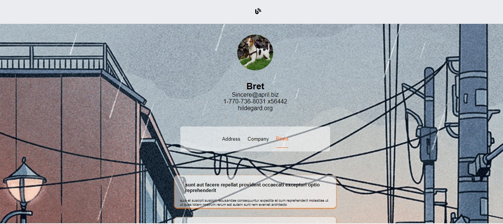

  <h1 align="center"> Blog</h1>


<p align="center">
    
</p>

____

## 👯‍♀️ Clonando

```bash
git clone  https://github.com/PedroSantoss-Dev/blog.git
```

____

## 🔧 Instalação

Clone o repositorio e execute o comando abaixo para instalar as dependencias.

```sh
   yarn
```

____


## Para executar a aplicação
```sh
    yarn dev
```
___

##  🛠️ Construído com
- 
- 
- 
- 

____

## 🔨 Funcionalidades do projeto
<details>
 <summary><b>/</b></summary> 
  <p align="center">
    
  </p>
  <p align="center">"Aqui está a página inicial, onde você pode visualizar todos os posts disponíveis e selecionar um para ver seus comentários correspondentes. </p>
</details>
<details>
 <summary><b>/posts/:id</b></summary> 
   <p align="center">
    
  </p>
  <p align="center">Aqui está a página do post selecionado, onde você pode visualizar o conteúdo e ler os comentários correspondentes ao mesmo. </p>
</details>

<details>
 <summary><b>/users</b></summary> 
  <p align="center">
    
  </p>
 <p align="center">Aqui está a página de usuários, onde você pode visualizar todos os usuários cadastrados e selecionar um deles para ver seus detalhes completos ao clicar em seu perfil</p>
</details>
<details>
 <summary><b>/users/user/:id</b></summary> 
   <p align="center">
    
  </p>
 <p align="center">Aqui está a página do usuário, onde você pode visualizar todas as informações relacionadas ao perfil do usuário. </p>
</details>

____

## 🔗 Apis
* Dog api (https://dog.ceo/)
* JSONPlaceholder (https://jsonplaceholder.typicode.com/)
____

✒️ Autores
* Pedro Santos (https://github.com/PedroSantoss-Dev);
___
## 🎁 Expressões de gratidão

* Conte a outras pessoas sobre este projeto 📢
* Dê uma nota alta pro trabalho.
* etc.
